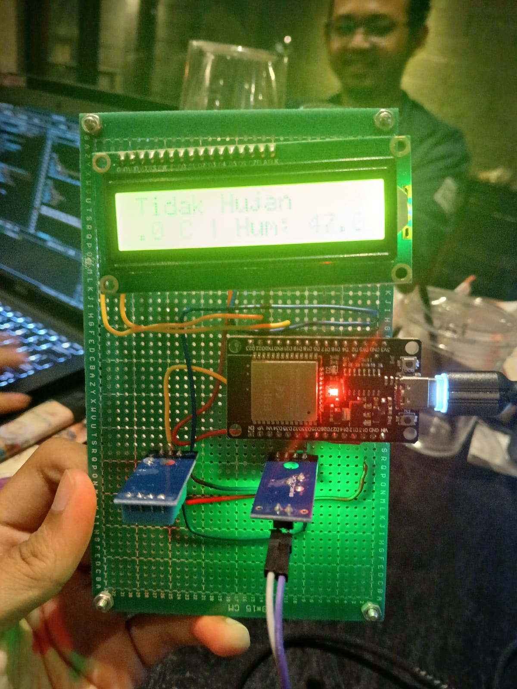

# basic-iot-device
Basic IoT project repository for computer network course

jadi gini lee...

berikut merupakan tugas ms S 



# Alat dan Bahan
- sensor raindrops
- sensor temperature dan humidty (dht terserah berapa aja)
- esp32 / esp8266
- kesabaran

## Back end install
```
cd ./back-end
npm install
```


